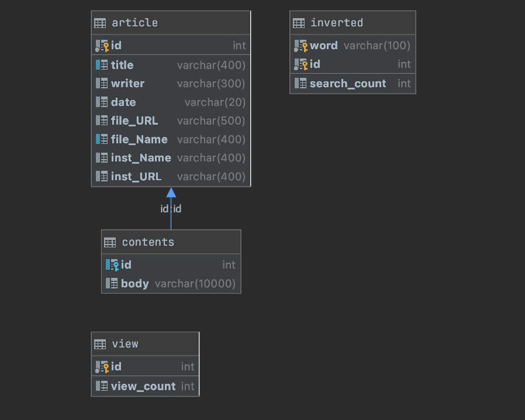
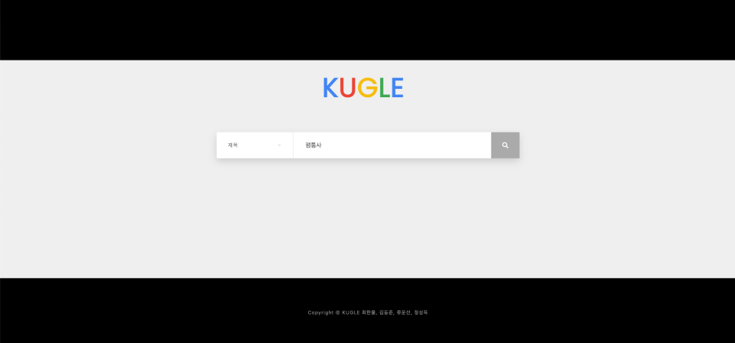
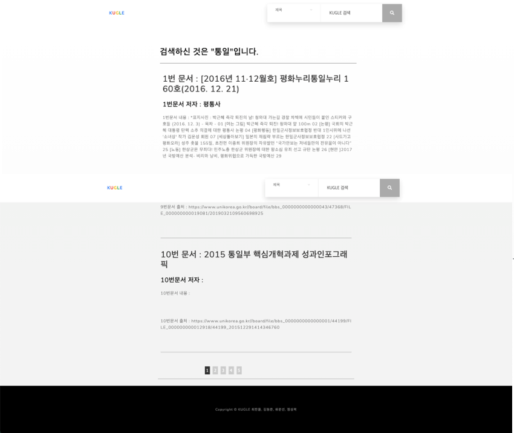
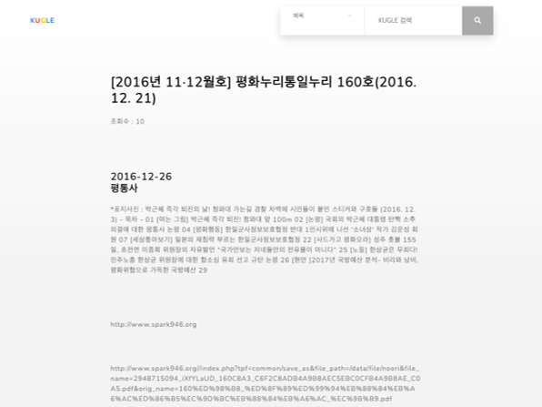

# **KUBIC 데이터 검색엔진**
## - KUGLE -

#### 통일/북한 관련 자료를 모아놓은 KUBIC에서 데이터를 가져와 만든 검색엔진

--- ---
## 실행
> ### **0. 라이브러리/버전 구축**
> - 코드 실행 전, 필요한 python 라이브러리는 모두 설치가 되어야함.
> ### **1. DB생성**
> - 하나의 database 생성 후, [`SQL.sql`](./SQL.sql)의 코드를 실행 (database 이름 : **"news"**)
  
> ### **2. [make.py](./make.py)실행 *<약간의 시간 소요>***
> - 실행을 위해선 KUBIC 데이터에 접근하기 위한 KEY가 필요함. ***_해당 KEY는 내 GOOGLE MAIL에 있당_*** 실행하면 한 숫자가 output으로 나올텐데 그 숫자를 기억해야함.
> ### **3. [start_DBflask.py](./start_DBflask.py)실행 *<많은 시간 소요>***
> - 해당 코드를 보면 초기에 `ID_input`을 초기화 하는 코드가 있는데, 2번에서 기억한 숫자를 `ID_input`에 넣어주면 된다. 또한 현재 접속망에 해당하는 자신의 local IP를 [templates](./DBflask/templates)에 있는 모든 `html`파일의 IP적는 부분에 적어야한다. (현재는 **IP입력**으로 되어있음. )
>> ### **How to get IP?** 
>> - 터미널에서 ipconfig를 통해 현재 네트워크망에서 자신의 ip를 알아낸 후 뒤에 포트번호를 붙인다. 예를들어 IP가 172.17.201.204이면 IP입력부분을 http://172.17.201.204:5000 로 바꿔주면 된다. 
>> - ipconfig아니어도 그냥 [start_DBflask.py](./start_DBflask.py)를 실행하면 터미널에 뜬다!
> ### **4. 실행모습**
> - 
> - 
> - 
> - 
> - 실행영상     